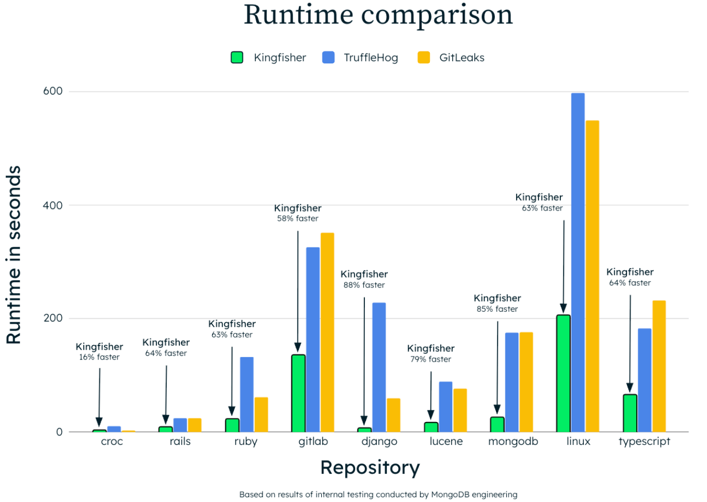
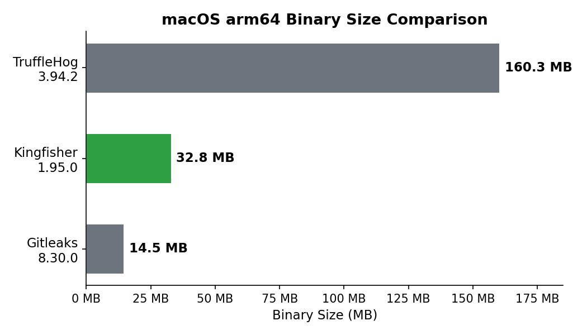

# Benchmark Comparison

## Runtime Comparison (seconds)
*Lower runtimes are better.*
| Repository | Kingfisher Runtime | TruffleHog Runtime | GitLeaks Runtime |
|------------|--------------------|--------------------|------------------|
| croc | 2.64 | 10.36 | 3.10 |
| rails | 8.75 | 24.19 | 24.24 |
| ruby | 22.93 | 132.68 | 61.37 |
| gitlab | 135.41 | 325.93 | 350.84 |
| django | 6.91 | 227.63 | 59.50 |
| lucene | 15.62 | 89.11 | 76.24 |
| mongodb | 25.37 | 174.93 | 175.80 |
| linux | 205.19 | 597.51 | 548.96 |
| typescript | 64.99 | 183.04 | 232.34 |

  

### Validated/Verified Findings Comparison

Note: For GitLeaks and detect-secrets, validated/verified counts are not available.

| Repository | Kingfisher Validated | TruffleHog Verified | GitLeaks Verified |
|------------|----------------------|---------------------|-------------------|
| croc | 0 | 0 | 0 |
| rails | 0 | 0 | 0 |
| ruby | 0 | 0 | 0 |
| gitlab | **6** | **6** | 0 |
| django | 0 | 0 | 0 |
| lucene | 0 | 0 | 0 |
| mongodb | 0 | 0 | 0 |
| linux | 0 | 0 | 0 |
| typescript | 0 | 0 | 0 |

### Network Requests Comparison
*'Network Requests' shows the total number of HTTP calls made during a scan. Since Gitleaks and detect‑secrets don’t validate secrets, they never make any network requests.*

| Repository | Kingfisher Network Requests | TruffleHog Network Requests | GitLeaks Network Requests |
|------------|-----------------------------|-----------------------------|---------------------------|
| croc | 0 | 17 | 0 |
| rails | 1 | 25 | 0 |
| ruby | 3 | 33 | 0 |
| gitlab | 17 | **15624** | 0 |
| django | 0 | 66 | 0 |
| lucene | 0 | 116 | 0 |
| mongodb | 1 | 191 | 0 |
| linux | 0 | 287 | 0 |
| typescript | 0 | 10 | 0 |

*Lower runtimes are better. Validated/Verified counts are reported where available. 'Network Requests' indicates the number of HTTP requests made during scanning.*

### Binary Size Comparison (macOS arm64)

| Tool | Version | Binary Size |
|------|---------|-------------|
| Gitleaks | 8.30.0 | 14.5 MB |
| **Kingfisher** | **1.95.0** | **32.8 MB** |
| TruffleHog | 3.94.2 | 160.3 MB |

*Smaller binaries are easier to distribute, deploy in CI, and embed in container images*

  

## Benchmark Environment

OS: darwin
Architecture: arm64
CPU Cores: 16
RAM: 48.00 GB
