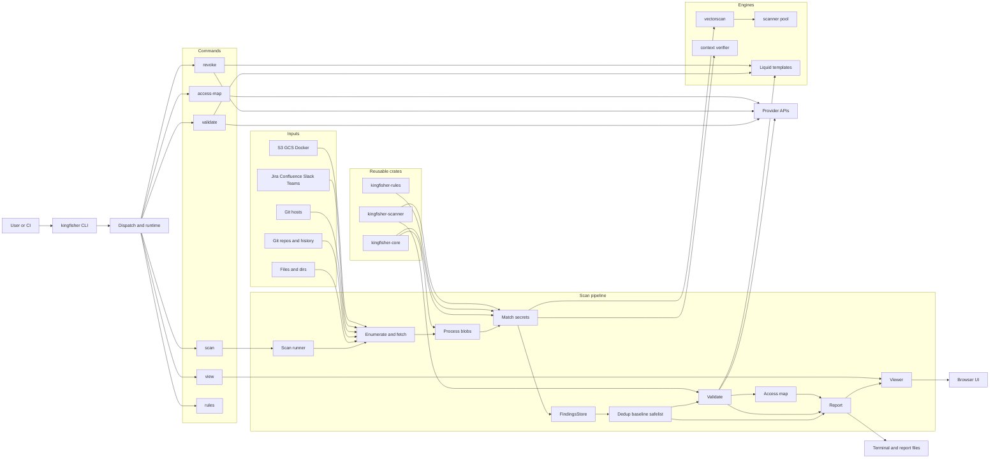

# Kingfisher Architecture

This document focuses on the runtime architecture of Kingfisher as implemented in this repository today.

It shows:

- a high-level component map of the main crates, modules, command paths, and outputs
- the execution flow for `kingfisher scan`

## Component Map

## What Lives Where

- `src/main.rs`: top-level command dispatch, Tokio runtime setup, allocator selection (mimalloc/jemalloc/system), update checks, and command routing.
- `src/scanner/runner.rs`: the orchestration hub for `scan`, including repo enumeration, clone streaming, artifact fetching, validation setup, sequential or parallel scan execution (threshold: >10 git repos triggers parallel mode), reporting, and summary generation.
- `src/scanner/*`: input enumeration (`enumerate.rs`), repository handling and artifact fetching (`repos.rs`), blob processing (`processing.rs`), validation coordination (`validation.rs`), scan summaries (`summary.rs`), Docker image scanning (`docker.rs`), and utilities (`util.rs`).
- `src/matcher/*`: the main detection engine (`mod.rs`), including vectorscan callbacks, regex helpers, Base64 discovery (`base64_decode.rs`), capture group handling (`captures.rs`), dedup support (`dedup.rs`), filtering (`filter.rs`), and finding fingerprinting (`fingerprint.rs`).
- `src/parser.rs` and `src/parser/*`: parser-based context verification for language-aware matching, with handwritten lexers plus lightweight HTML and CSS parsers.
- `src/scanner_pool.rs`: thread-local vectorscan `BlockScanner` pool, providing safe reuse of compiled pattern databases across scan threads.
- `src/reporter.rs` and `src/reporter/*`: report rendering for pretty, JSON, BSON, TOON, SARIF, and HTML outputs, plus the data model used by the viewer.
- `src/direct_validate.rs`: direct validation of a known secret without going through pattern matching. Supports HTTP, gRPC, plus schema-level typed validators such as AWS, AzureStorage, GCP, JDBC, MongoDB, MySQL, PostgreSQL, JWT, and Coinbase, and delegates ad-hoc `Raw` validators to `crates/kingfisher-scanner/src/validation/raw.rs`.
- `src/direct_revoke.rs`: direct revocation of a known secret without going through the scan pipeline. Uses Liquid templates for revocation configurations and supports multi-step HTTP revocation flows.
- `src/access_map.rs` and `src/access_map/*`: standalone blast-radius mapping with 24 provider implementations including AWS, Azure, GCP, GitHub, GitLab, Slack, Bitbucket, Gitea, Hugging Face, Buildkite, Anthropic, OpenAI, and more.

## Notes And Boundaries

- The main CLI scan path is implemented primarily in the application modules under `src/`, not in `kingfisher-scanner`.
- `kingfisher-scanner` is still important: it provides the embeddable scanner API plus shared validation and primitive functionality reused by the application.
- The shared validation layer in `crates/kingfisher-scanner/src/validation/` contains both reusable typed validator families and the `Raw` exception-path validators used by rule YAML.
- Direct `validate`, `revoke`, and standalone `access-map` are sibling command paths. They are not downstream stages of `FindingsStore`.
- Reporting is downstream from the datastore, which lets Kingfisher emit multiple output formats and drive the local viewer from the same finding set.
- The matching layer is intentionally hybrid: vectorscan provides high-throughput SIMD-accelerated pattern detection, while regex helpers, Base64 support, and parser-based context verification improve accuracy and reduce false positives.
- `FindingsStore` uses an in-memory store with a Bloom filter for deduplication, replacing the earlier SQLite-based storage model.
- Validation and revocation templates are rendered via Liquid, allowing rule authors to define HTTP request sequences, variable extraction, and multi-step flows in YAML without touching Rust code.
